# DevOps Project with Github Action pipeline

<div align="center">
  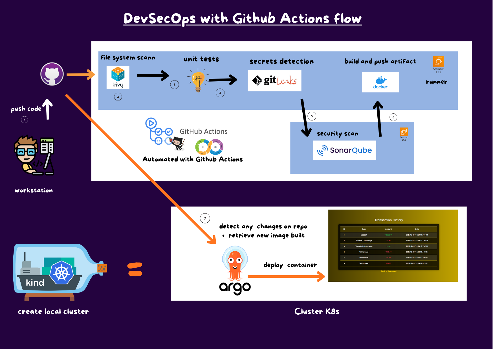

 </div>

## clone the repo on your workstation

```bash
git clone https://github.com/fleury12/Github-Actions-Project.git

```
delete the maven.yml file present in directory .github\worlflow
the goal her is to help you build you own github actions pipeline

## create a pipeline

Go on your reposirtory-> Action -> new workflow and select "Publish Java Package with Maven".

<div align="center">
  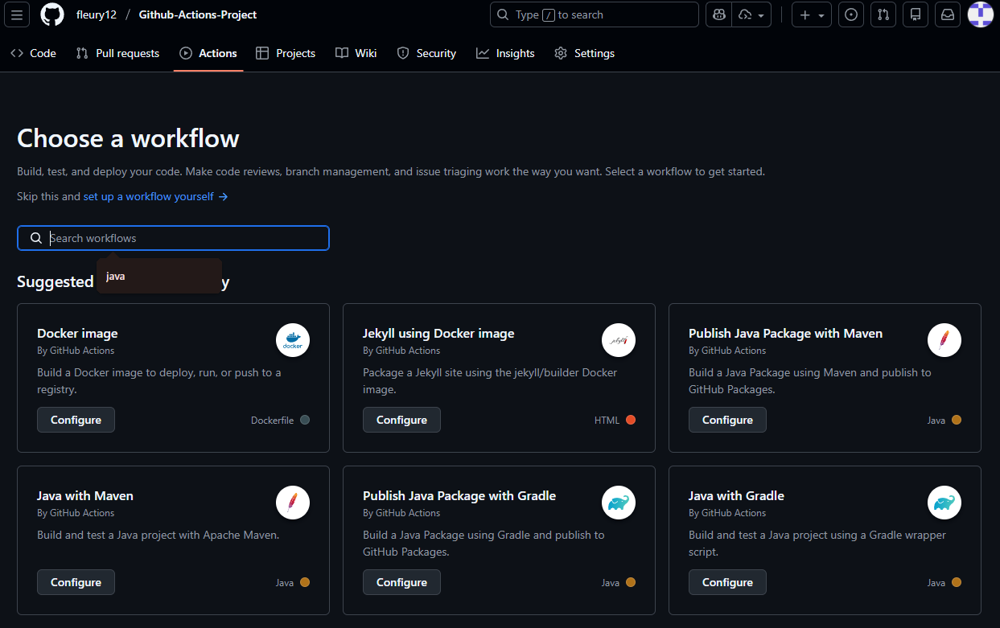

</div>

you will a template for your workflow.

### first job compile

This job compile aour java code

 ```yaml
 name: Java CI with Maven

on:
  push:
    branches: [ "main" ]
  pull_request:
    branches: [ "main" ]
#the bellow lign indicate that this workflow runs automatically on push and pull_request action

jobs:
  compile:
    runs-on: ubuntu-latest

    steps:
    - uses: actions/checkout@v4
      
    - name: Set up JDK 17
      uses: actions/setup-java@v4
      with:
        java-version: '17'
        distribution: 'temurin'
        cache: maven
        
    - name: Build with Maven
      run: mvn compile

 ```
commit change and go on Anctio  to see your job. you can edit the file direcly in your repo.
This job uses a runner machine name ubuntu-latest. It is a shared runner which is provide by github. But, we can setup our private runner.

### set up private runner
 for this task you need to ceate an EC2 instance on aws with 25 go memory and t3 medium. create a new security group and keypair for ssh connection.
 Make sure to have the following ports enabled on your instance: 

<div align="center">
  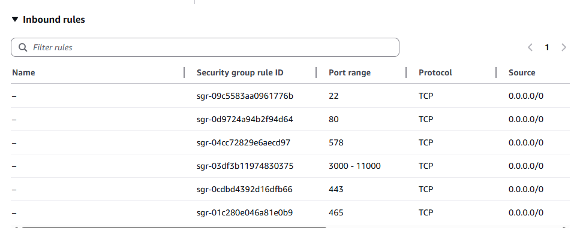

</div>

### connect to your instance

follow instructions
<div align="center">
  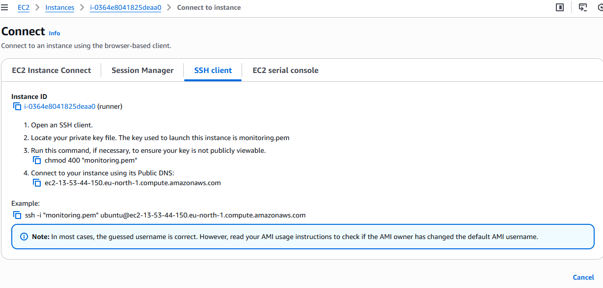

</div>

 update you machine 

 ```bash
 sudo apt update
 
 ```
### configure private runner
 go on you repository settings->Actions->runner 

 create a Self-hosted runner 
 <div align="center">
  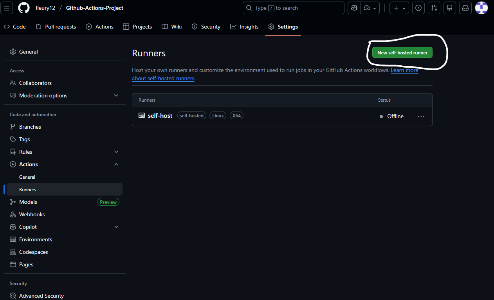

</div>

follow this instructyion and execute this commands on you private runner 
 <div align="center">
  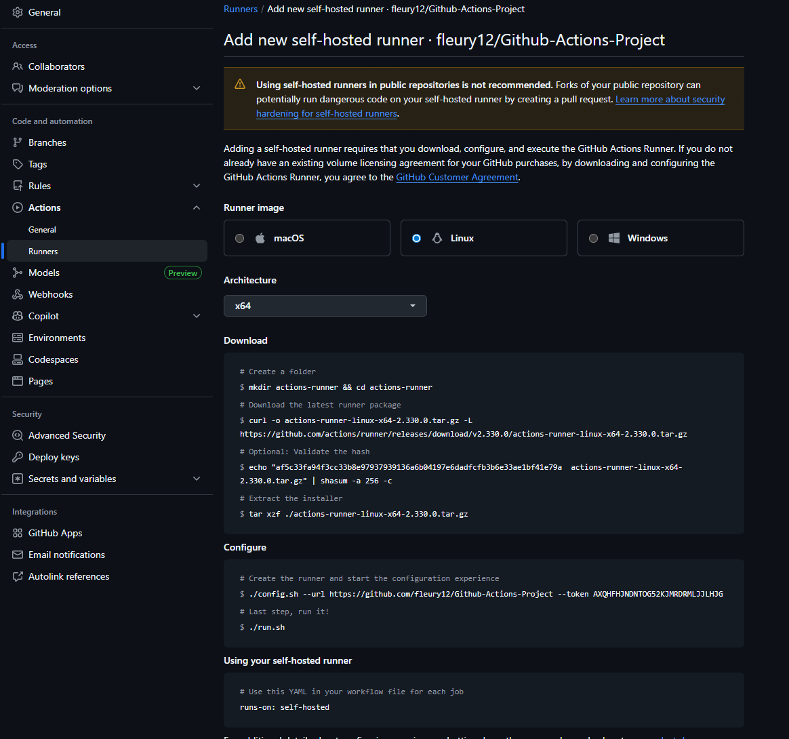

</div>

replace on your job the runner by : self-hosted   (label of you runner )

```yaml
 name: Java CI with Maven

on:
  push:
    branches: [ "main" ]
  pull_request:
    branches: [ "main" ]
#the bellow lign indicate that this workflow runs automatically on push and pull_request action

jobs:
  compile:
    runs-on: self-hosted

    steps:
    - uses: actions/checkout@v4
      
    - name: Set up JDK 17
      uses: actions/setup-java@v4
      with:
        java-version: '17'
        distribution: 'temurin'
        cache: maven
        
    - name: Build with Maven
      run: mvn compile

 ```
 if you get error on maven , install mavem on your runner: 

 ``` bash
 sudo apt install mavem
 ```

### Security check job
 
 This job is to scan file system with trivy and verify if your code contains sensitive informations (secrets)

 "need:compile" is to indicate that the compile job must be finish before this job starts.

```yaml
  security-check:
    runs-on: self-hosted
    needs: compile

    steps:
    - uses: actions/checkout@v4
    - name: Trivy installation
      run: |
        sudo apt-get install wget gnupg
        wget -qO - https://aquasecurity.github.io/trivy-repo/deb/public.key | gpg --dearmor | sudo tee /usr/share/keyrings/trivy.gpg > /dev/null
        echo "deb [signed-by=/usr/share/keyrings/trivy.gpg] https://aquasecurity.github.io/trivy-repo/deb generic main" | sudo tee -a /etc/apt/sources.list.d/trivy.list
        sudo apt-get update
        sudo apt-get install trivy
        
    - name: FS scann
      run: trivy fs --format table -o fs-report.json .
      
    - name: gitleaks installation
      run: sudo apt install gitleaks -y
      
    - name: gitleaks scan
      run: gitleaks detect source . -r gitleaks-report.json -f json

```
### Run unit test 

```yaml
 test:
    runs-on: self-hosted
    needs: security-check

    steps:
    - uses: actions/checkout@v4
      
    - name: Set up JDK 17
      uses: actions/setup-java@v4
      with:
        java-version: '17'
        distribution: 'temurin'
        cache: maven
        
    - name: Unit Test
      run: mvn test

```
### Setup sonarqube
 
 create EC2 instance with the same security group as your runner and set up sonarqube

```bash
    
    sudo apt-get update
    sudo apt-get install docker.io -y
    sudo usermod -aG docker $USER  # Replace with your system's username, e.g., 'ubuntu'
    newgrp docker  #it alow you to execute docker command
    ```

```bash
docker run -d --name sonar -p 9000:9000 sonarqube:lts-community

```
 Username and password: admin

 got to Administration->security->user and create a token for you user.

  <div align="center">
  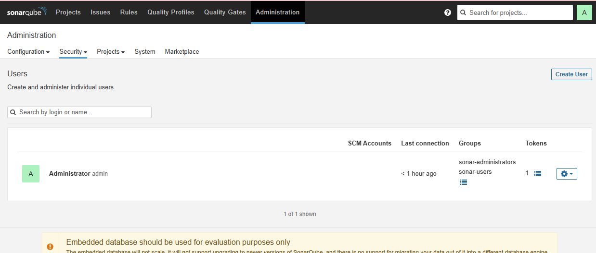

</div>

Setup these credential in SSettings->Secret..->actions

- SONAR_TOKEN 
- SONAR_HOST_URL  (http://ip_of_sonarqube_instance:9000/)
 <div align="center">
  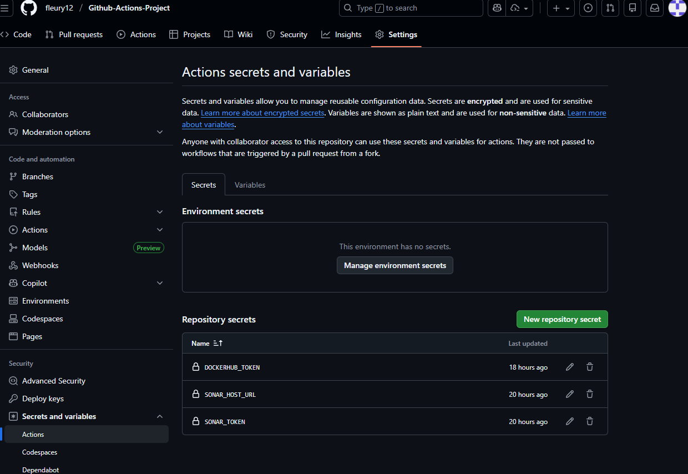

 </div>


```yaml
  Build_project_sonar:
    runs-on: self-hosted
    needs: test
    
    steps:
    - uses: actions/checkout@v4
      
    - name: Set up JDK 17
      uses: actions/setup-java@v4
      with:
        java-version: '17'
        distribution: 'temurin'
        cache: maven
        
    - name: Build project
      run: mvn package
    
    - name: Upload JAR artifact
      uses: actions/upload-artifact@v4
      with:
        name: app.jar
        path: target/*.jar

    - uses: actions/checkout@v4
      with:
        # Disabling shallow clones is recommended for improving the relevancy of reporting
        fetch-depth: 0
    - name: SonarQube Scan
      uses: SonarSource/sonarqube-scan-action@v7.0.0 # Ex: v4.1.0 or sha1, See the latest version at https://github.com/marketplace/actions/official-sonarqube-scan
      env:
        SONAR_TOKEN: ${{ secrets.SONAR_TOKEN }}
        SONAR_HOST_URL: ${{ vars.SONAR_HOST_URL }}

    - name: SonarQube Quality Gate check
      id: sonarqube-quality-gate-check
      uses: sonarsource/sonarqube-quality-gate-action@master
      with:
        pollingTimeoutSec: 600
      env:
        SONAR_TOKEN: ${{ secrets.SONAR_TOKEN }}
        SONAR_HOST_URL: ${{ secrets.SONAR_HOST_URL }} #OPTIONAL

    - name: "Example show SonarQube Quality Gate Status value"
      run: echo "The Quality Gate status is ${{ steps.sonarqube-quality-gate-check.outputs.quality-gate-status }}"

```

### Build image and push

set up docker credential:
- DOCKERHUB_USERNAME
- DOCKERHUB_TOKEN 

```yaml
  build_docker_imand_and_push:
    runs-on: self-hosted
    needs: Build_project_sonar

    steps:
    - uses: actions/checkout@v4
      
    - name: Donwload JAR artifact
      uses: actions/download-artifact@v4
      with:
        name: app.jar
        path: app 

    - name: Login to Docker Hub
      uses: docker/login-action@v3
      with:
        username: ${{ vars.DOCKERHUB_USERNAME }}
        password: ${{ secrets.DOCKERHUB_TOKEN }}
    - name: Set up QEMU
      uses: docker/setup-qemu-action@v3
    - name: Set up Docker Buildx
      uses: docker/setup-buildx-action@v3
    - name: Build and push
      uses: docker/build-push-action@v6
      with:
        context: .
        push: true
        tags: fleury12/app:latest

```
Install docker on your runner as you did on you sonarqube install

commit your changes

<div align="center">
    
</div>

<div align="center">
  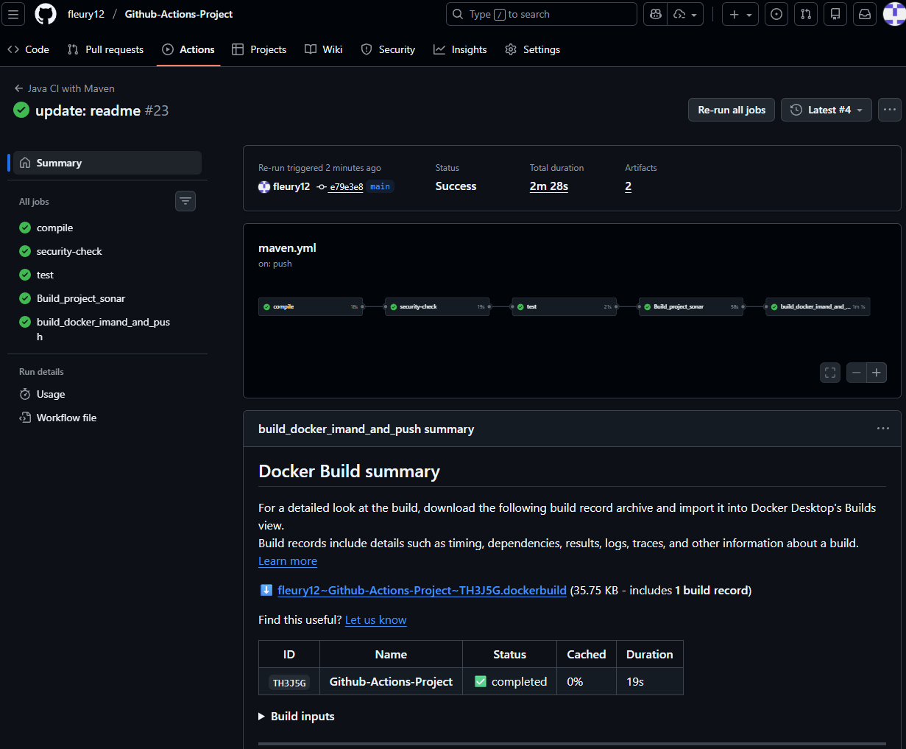

 </div>

## Deploy on kind local cluster
Make sure to ahve kind installed on you locla machine

1. **Install ArgoCD:**
    
    You can install ArgoCD on your Kubernetes cluster by following the instructions : 

```bash
kind create cluster --name my-cluster
```

```bash
$ kubectl create namespace argocd
$ kubectl apply -n argocd -f https://raw.githubusercontent.com/argoproj/argo-cd/v2.11.2/manifests/install.yaml

$ export ARGOCD_PWD=$(kubectl -n argocd get secret argocd-initial-admin-secret -o jsonpath="{.data.password}" | base64 -d)
$ echo "Argo CD admin password: $ARGOCD_PWD"
```
connect to you argocd

```bash
$ nohup kubectl port-forward svc/argocd-server -n argocd 8082:443 > /dev/null 2>&1 &
```
Go to [localhost:8082](http://localhost:8082)  in you browser username: admin passw: $ARGOCD_PWD

2. **Set Your GitHub Repository as a Source:**
    
    After installing ArgoCD, you need to set up your GitHub repository as a source for your application deployment. This typically involves configuring the connection to your repository and defining the source for your ArgoCD application. The specific steps will depend on your setup and requirements.

3. **Create an ArgoCD Application:**
    - `name`: Set the name for your application.
    - `destination`: Define the destination where your application should be deployed.
    - `project`: Specify the project the application belongs to.
    - `source`: Set the source of your application, including the GitHub repository URL, revision, and the path to the application within the repository.
    - `syncPolicy`: Configure the sync policy, including automatic syncing, pruning, and self-healing.

<div align="center">
  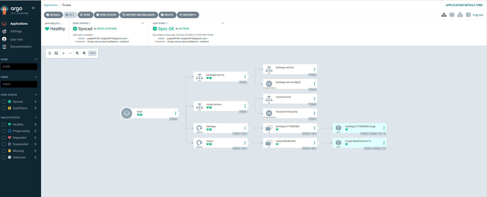

 </div>

 to access to our application we need to do port forwarding to 

 ```bash
 $ kubectl get svc
NAME              TYPE        CLUSTER-IP      EXTERNAL-IP   PORT(S)        AGE
bankapp-service   NodePort    10.96.150.119   <none>        80:30152/TCP   134m
kubernetes        ClusterIP   10.96.0.1       <none>        443/TCP        3h19m
mysql-service     ClusterIP   10.96.206.137   <none>        3306/TCP       134m

$ kubectl port-forward svc/bankapp-service 8088:80 > /dev/null 2>&1 &
 ```

 <div align="center">
  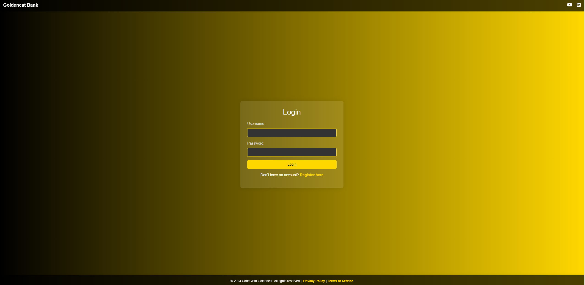

 </div>

<div align="center">
  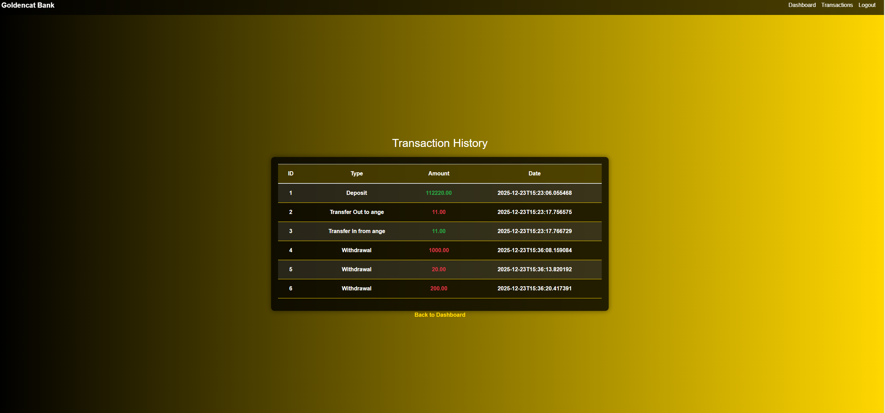

 </div>